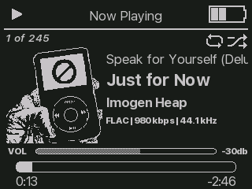
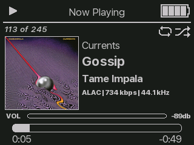
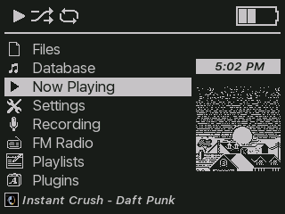
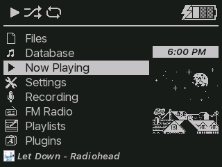
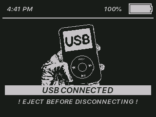

# minimal_RTCsync

Version 1.0

Last Update: 01/26/2026

License: CC-BY-SA 3.0

By: Monica G.

Description: Minimalist but modern theme. All pixel art is by me. The picture on the menu changes according to the time of day (changes at 6 AM, 12 PM, and 6 PM). 
Code based on: BACKBONE and Pixel Computer by me! which are based on SNARTY by Simon Anden and BONES by Chuck Largo!
Icons & viewers from my 1ST_GEN_REMIX theme with some small changes. Hold screen does not show album art.
The San Francisco font is owned by Apple Inc. and this theme does not claim any ownership over the font.

## fonts
- SemiboldItalic
- SFProText-Regular
- SFProText-SemiboldItalic
- SFProText-Bold.fnt)

## wps screenshots

## menu screenshots

## usb screenshot

